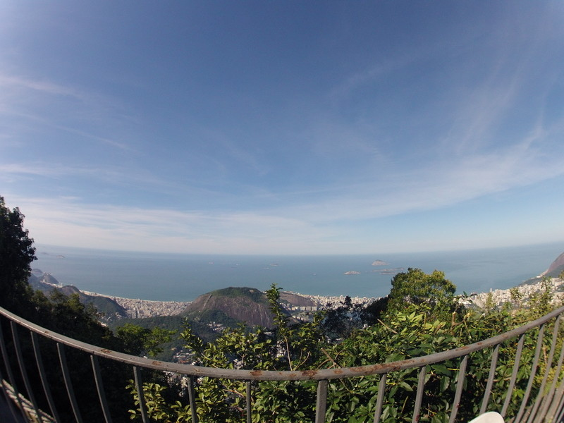
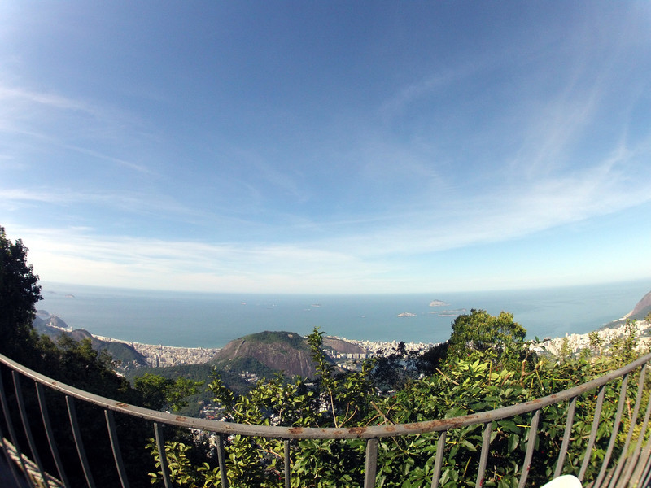
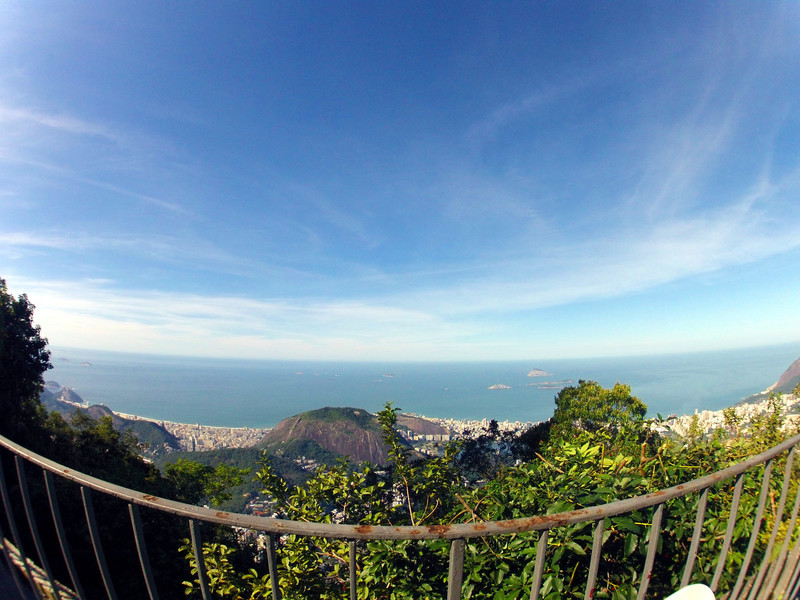
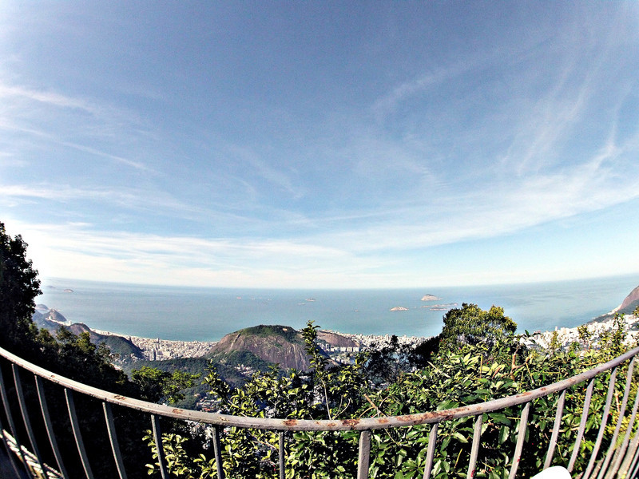
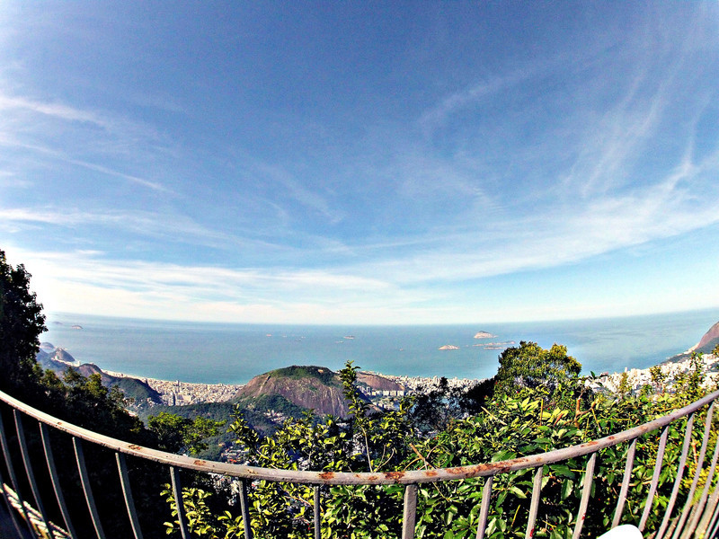

# @woile's darkroom

> Collection of scripts I use to enhace photographies.

## Pre-requisites

OS: `Debian GNU/Linux 9 (stretch) 64-bit` (It might work on other linux distros)

Gimp version: `2.8`

## Packages

`sudo apt install gimp gimp-plugin-registry`

## Installation

`./install` or `sudo ./install` if required

## Commands

| command | description |
|---------|-------------|
| `darkroom init` | creates folders and copies raw photos to `raw_backup` folder |
| `darkroom auto_levels "<images_pattern>"` | Auto White Balance / Contrast Stretch / HSV Stretch |
| `darkroom color_enhance "<images_pattern>"` | Improves color, not always works as expected |
| `darkroom natgeo "<images_pattern>"` | Applies national geographic effect |

Note: It is required to wrap the patter between double quotes, unfortunately this is the way
gimp receives the images.

## Examples

| command | example |
|---------|:---------:|
| original |  |
| `darkroom auto_levels "*.JPG"` |  |
| `darkroom auto_levels "*.jpg darkroom color_enhance "*_al.JPG"` |  |
| `darkroom auto_levels "*.jpg" && darkroom natgeo "*_al.JPG"` |  |
| `darkroom auto_levels "*.jpg" && darkroom color_enhance "*_al.jpg" && darkroom natgeo "*_al_ce*.jpg"` |  |

## CONTRIBUTE

Please feel free to create PR with new scripts and effect, and suggesting improvements to my current
flow.

Thank you!